# Image-Inpainting
Inpaint image using Segment Anything, Large Mask Inpainting and Stable Diffusion 

## Installation
```bash
git clone https://github.com/tungtrungpham/Image-Inpainting.git
python -m pip install -r requirements.txt
python app.py
```
Make sure you download checkpoint for LaMa ([lama checkpoint](https://drive.google.com/drive/folders/17ogO5S1f3ZZcUOHlyH51BQsTlzRHOnQN)) and put it into `./pretrained_weights` before run `python app.py`
## <span id="remove-object"> 1. Remove Object</span>
- Click on an object;
- [Segment Anything Model 2](https://ai.meta.com/sam2/) (SAM2) segments the object out;
- [Large Mask Inpainting](https://advimman.github.io/lama-project/) (LaMa) remove the masked object.

### Demo
<table>
  <tr>
    <td></td>
    <td>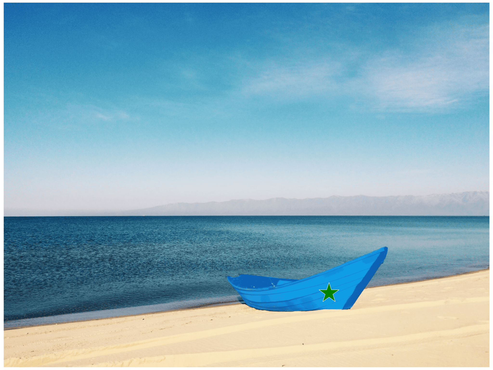</td>
    <td></td>
  </tr>
</table>

<table>
  <tr>
    <td></td>
    <td>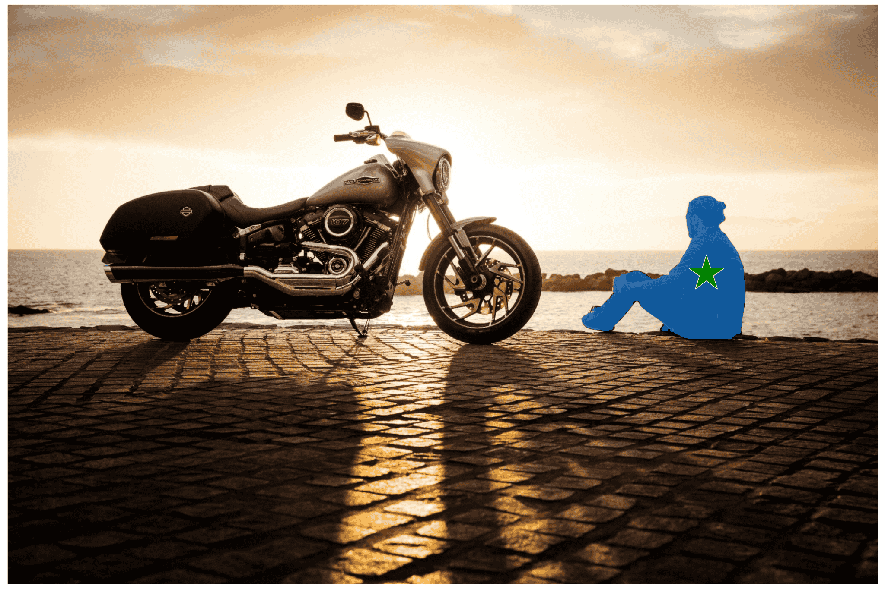</td>
    <td></td>
  </tr>
</table>

## <span id="replace-object"> 2. Replace Object</span>
- Click on an object;
- [Segment Anything Model 2](https://ai.meta.com/sam2/) (SAM2) segments the object out;
- [Stable Diffusion](https://stability.ai/news/stable-diffusion-v2-release) (SD) replace the masked object according to the text prompt.

### Demo
<table>
    <caption align="center">Text prompt: "A vintage-style wall clock"</caption>
        <tr>
            <td>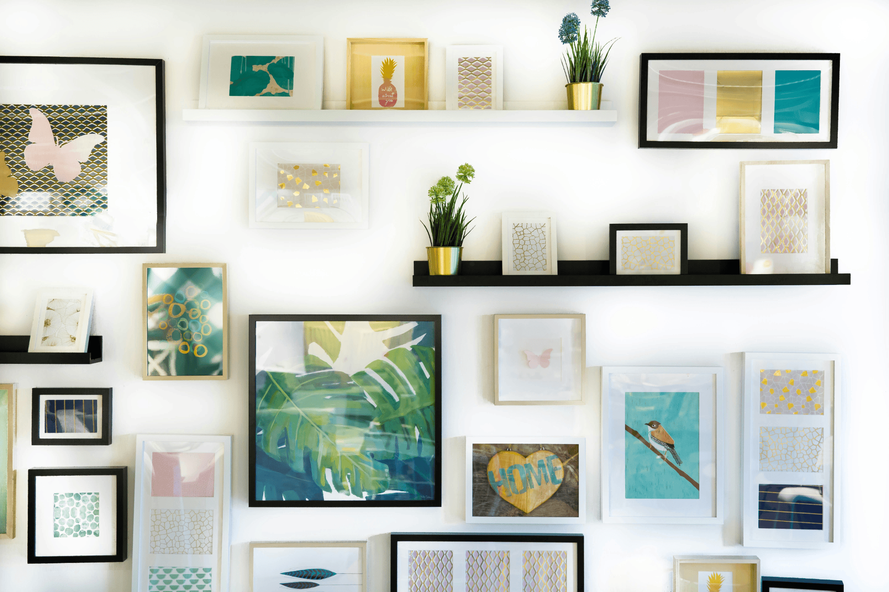</td>
            <td>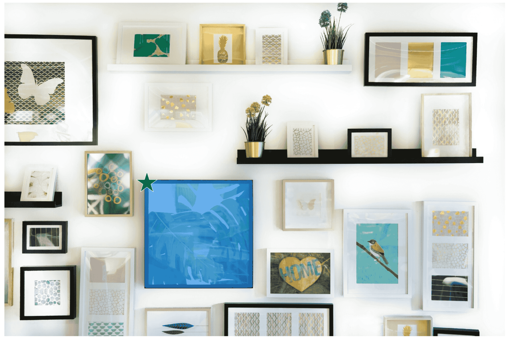</td>
            <td>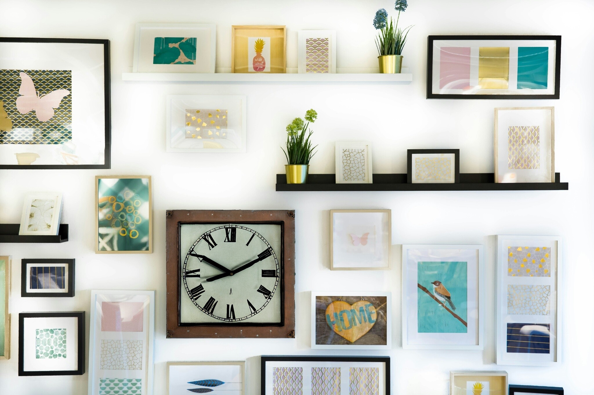</td>
        </tr>
</table>

<table>
    <caption align="center">Text prompt: "A sports car on the road"</caption>
        <tr>
            <td>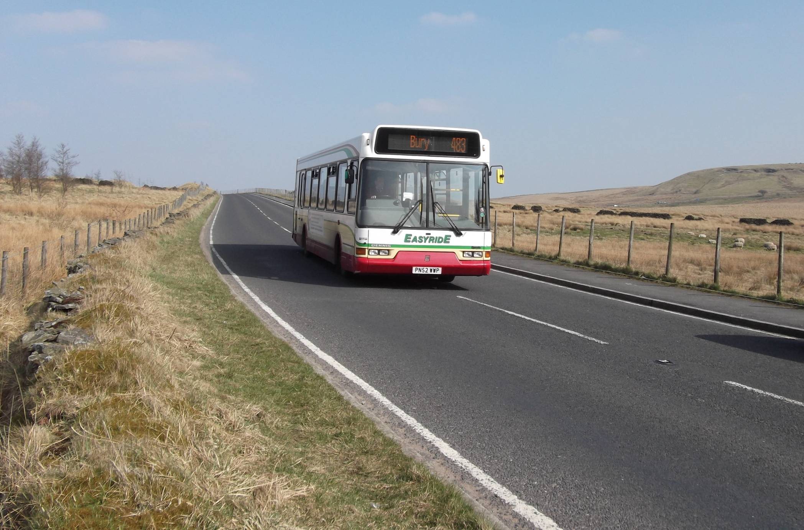</td>
            <td>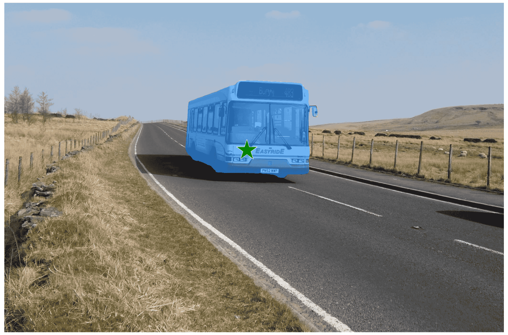</td>
            <td>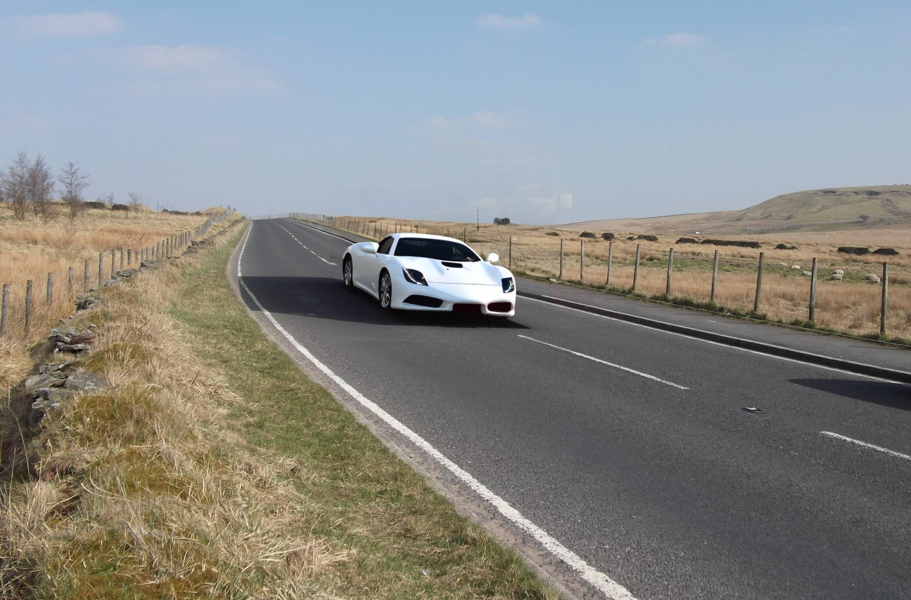</td>
        </tr>
</table>


## <span id="replace-background"> 3. Replace Background</span>
- Click on an object;
- [Segment Anything Model 2](https://ai.meta.com/sam2/) (SAM2) segments the object out;
- [Stable Diffusion](https://stability.ai/news/stable-diffusion-v2-release) (SD) replace the background according to the text prompt.

### Demo
<table>
    <caption align="center">
        Text prompt: "Living room of a classical style house" <br>
        Negative prompt: "unreal"
    </caption>
        <tr>
            <td></td>
            <td>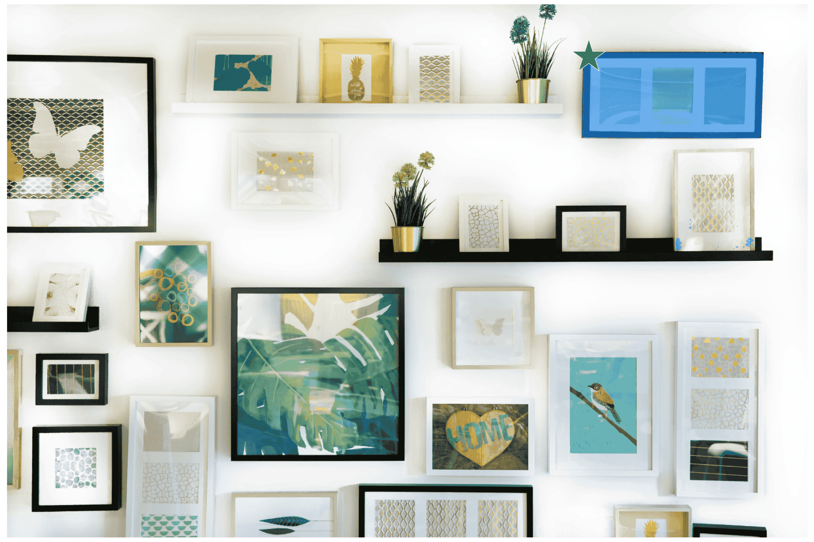</td>
            <td>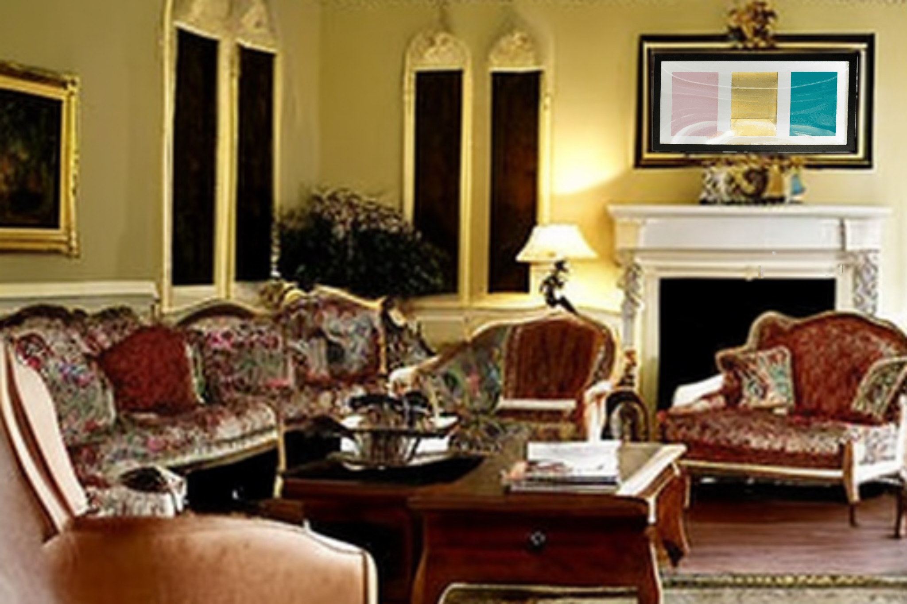</td>
        </tr>
</table>

<table>
    <caption align="center">
        Text prompt: "A bus on a city road" <br>
        Negative prompt: "unreal"
    </caption>
        <tr>
            <td></td>
            <td></td>
            <td>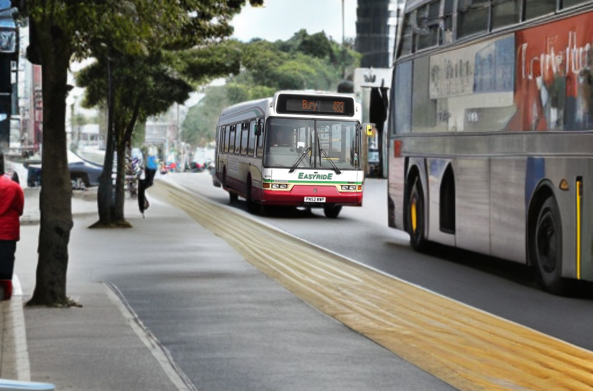</td>
        </tr>
</table>


## Acknowledgments
- [Segment Anything](https://ai.meta.com/sam2/)
- [LaMa](https://github.com/advimman/lama)
- [Stable Diffusion](https://stability.ai/news/stable-diffusion-v2-release)
